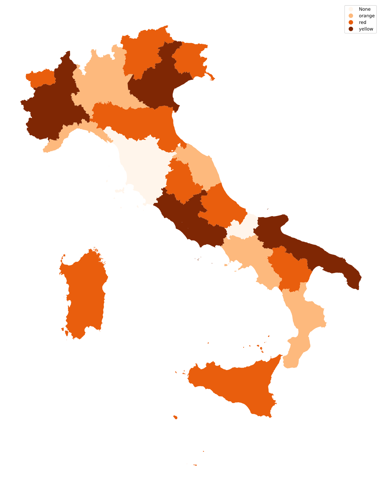
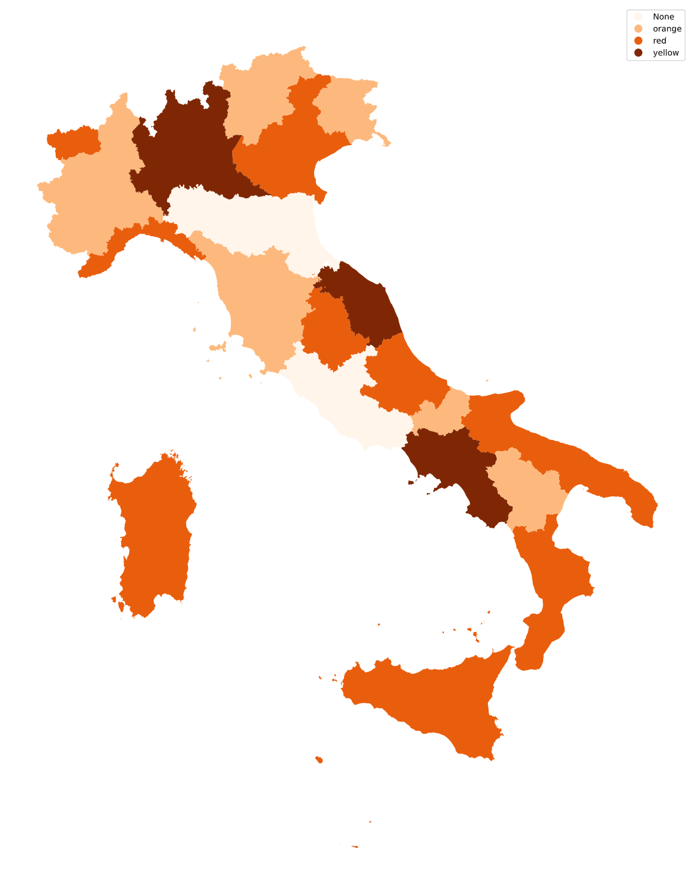

# 3_color_problem_italy_regions

This is a small script in python, made during the writing of my Bachelor Degree in Computer Science thesis, as a method of procrastination.
The idea comes from the subdivision of the regions, by the Italian Government, for the application of different regulations regarding the containment of SARS-covid-2 virus (Covid-19).

The code explores the possibility of the regions to be coloured with just 3 possible different colours.
This is a well know problem in Computer Science, [Graph Coloring](https://en.wikipedia.org/wiki/Graph_coloring).

I used the Spatial database from [**italian-maps-shapefiles**](https://github.com/sramazzina/italian-maps-shapefiles) repository, that I modify to eliminate some problem with some of the values, which did contain some special character.

The code implements the a greedy algorithm, therefore is order dependent for the input region names.

### Result:

Italy regions are **not** 3-colourable!

In alphabetical order, <u>Molise</u> and <u>Toscana</u> have no possible colour assigned.

In Reverse alphabetical order, <u>Emilia Romagna</u> and <u>Lazio</u> have no possible colour assigned.

|                 **Alphabetical Order**                 |    **Reverse Alphabetical order**     |
| :----------------------------------------------------: | :-----------------------------------: |
|  |  |
